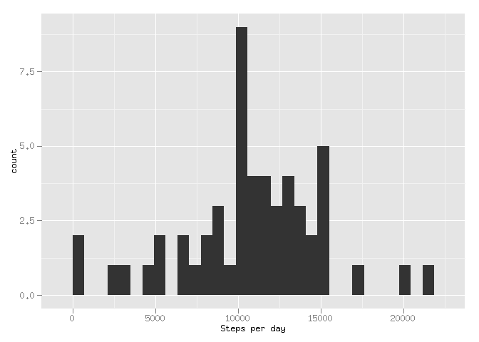
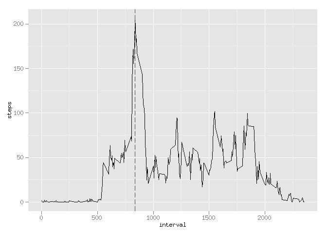

# Reproducible Research: Peer Assessment 1


## Loading and preprocessing the data

```r
library(ggplot2)
activity <- read.csv(unz("activity.zip", "activity.csv"))
activity$date = as.POSIXct(activity$date)
```


## What is mean total number of steps taken per day?

```r
activity.per_day = aggregate(steps ~ date, activity, FUN = sum)
activity.per_day.mean = mean(activity.per_day$steps)
activity.per_day.median = median(activity.per_day$steps)
qplot(activity.per_day$steps, xlab = "Steps per day")
```

```
## stat_bin: binwidth defaulted to range/30. Use 'binwidth = x' to adjust this.
```

 

**Total number of steps taken per day**  
Mean: 10766.19  
Median: 10765


## What is the average daily activity pattern?

```r
activity.per_interval = aggregate(steps ~ interval, activity, FUN = mean)
max_steps = max(activity.per_interval$steps)
most_active_row = with(activity.per_interval, activity.per_interval[steps == max_steps,])
most_active_interval = most_active_row$interval
qplot(x = interval, y = steps, data = activity.per_interval, geom = ("line")) + 
  geom_vline(xintercept = most_active_interval, col = "red", linetype = "longdash")
```

 

Most active interval is interval #835.


## Imputing missing values

```r
number_of_NA = sum(is.na(activity$steps))
# fill missing values with mean values of that interval 
```
Total number of missing values is 2304.


## Are there differences in activity patterns between weekdays and weekends?
