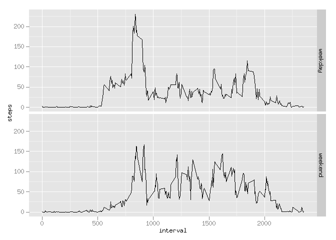

# Reproducible Research: Peer Assessment 1


## Loading and preprocessing the data

```r
library(ggplot2)
activity <- read.csv(unz("activity.zip", "activity.csv"))
activity$date = as.POSIXct(activity$date)
```


## What is mean total number of steps taken per day?

```r
activity.per_day = aggregate(steps ~ date, activity, FUN = sum)
activity.per_day.mean = mean(activity.per_day$steps)
activity.per_day.median = median(activity.per_day$steps)
qplot(activity.per_day$steps, xlab = "Steps per day")
```

```
## stat_bin: binwidth defaulted to range/30. Use 'binwidth = x' to adjust this.
```

 

**Total number of steps taken per day**  
Mean: 10766.19  
Median: 10765


## What is the average daily activity pattern?

```r
activity.per_interval = aggregate(steps ~ interval, activity, FUN = mean)
max_steps = max(activity.per_interval$steps)
most_active_row = with(activity.per_interval, activity.per_interval[steps == max_steps,])
most_active_interval = most_active_row$interval
qplot(x = interval, y = steps, data = activity.per_interval, geom = ("line")) + 
  geom_vline(xintercept = most_active_interval, col = "red", linetype = "longdash")
```

 

Most active interval is interval #835, it includes 206 steps average.


## Imputing missing values

Fill missing values using mean values of appropriate interval:


```r
number_of_NA = sum(is.na(activity$steps))

# function returns mean steps value on specified interval using
# previously calculated table activity.per_interval
interval_to_mean_steps <- function(interval) {
  idx <- which(activity.per_interval[,'interval'] == interval)
  activity.per_interval[idx,]$steps
}

# rows of original data with undefined steps values
rows_with_NA = activity[is.na(activity$steps),]

# create copy of original data frame
activity.imputing_steps = activity

# fill missing steps values using mean values of appropriate interval:
activity.imputing_steps[is.na(activity.imputing_steps$steps),]$steps = 
  sapply(rows_with_NA$interval, interval_to_mean_steps)

# recalculate basic parameters for new dataset
activity.imputing_steps.per_day = aggregate(steps ~ date, activity.imputing_steps, FUN = sum)
activity.imputing_steps.per_day.mean = mean(activity.imputing_steps.per_day$steps)
activity.imputing_steps.per_day.median = median(activity.imputing_steps.per_day$steps)
qplot(activity.imputing_steps.per_day$steps, xlab = "Steps per day (with NA filling)")
```

```
## stat_bin: binwidth defaulted to range/30. Use 'binwidth = x' to adjust this.
```

 

Total number of missing values is 2304.

**Total number of steps taken per day (with NA filling)**  
Mean: 10766.19  
Median: 10766.19

## Are there differences in activity patterns between weekdays and weekends?

```r
is.weekend <- function(day_name) {
  if (day_name == "Saturday" || day_name == "Sunday")
    "weekend"
  else    
    "weekday"
}
activity.imputing_steps$weekday <- factor(sapply(weekdays(activity.imputing_steps$date), is.weekend))
activity.imputing_steps.per_interval = aggregate(steps ~ interval + weekday, activity.imputing_steps, FUN = mean)

qplot(x = interval, y = steps, data = activity.imputing_steps.per_interval, geom = ("line")) + 
  facet_grid(weekday ~ .)
```

 
